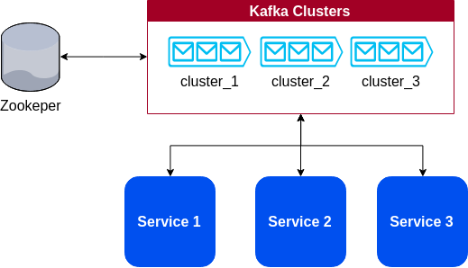
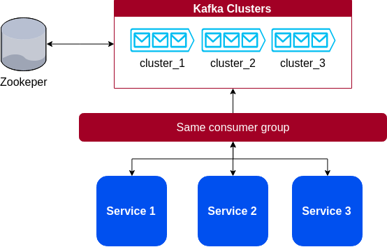

# Kafka Streams
> Minor POC with Kafka streams

Minor POC did with the tutorial https://www.baeldung.com/java-kafka-streams.

Really great [article](https://balamaci.ro/kafka-streams-for-stream-processing/) about.

## About

After struggle **a lot** I discover the right configuration.

With three Kafka brokers, all registered on one instance of Zookeeper.
I was able to run three replicas of the same application.



But the glue that make all works is the fact that all three replicas are in the same consumer group.



This way, two replicas will not consume the same event. We will be scaling processing instead.

Once running all the stack, I was able to produce messages (using my other project [Kafka Event Manager](https://github.com/alexrochas/kafka_event_manager)) and the output was almost everytime in different replicas. 

> still studying how to explain the exactly load-balance algorithm here...

## Running

Because I have to broke my original docker-compose in order to start all the containers in the exactly order, here is the order:

```bash
~/project/folder/$ docker-compose -f docker-compose-zookeeper.yml up
~/project/folder/$ docker-compose -f docker-compose.yml up #kafka brokers
~/project/folder/$ docker-compose -f docker-compose-replicas.yml up
```

At last, clone it, see for yourself and have a good study!

## Roadmap

 * implement using Kafka streams from Spring framework
 * improve README.md

## Useful links

* [How to choose the number of topics/partitions in a Kafka cluster? ](https://balamaci.ro/kafka-streams-for-stream-processing/)

## Meta

Alex Rocha - [about.me](http://about.me/alex.rochas)
